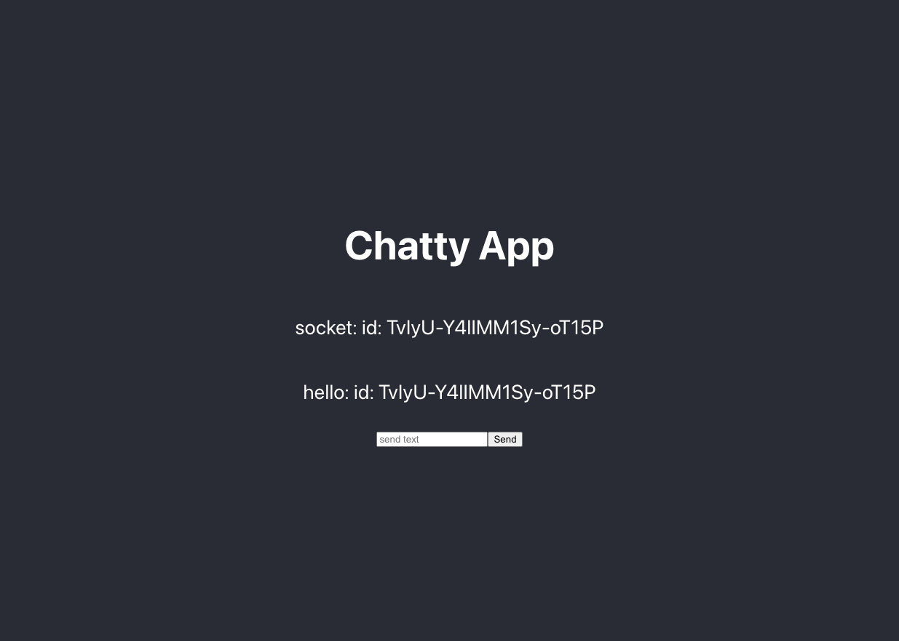

# Socket.io-with-React

This is My First Socket.io project with React.
The project is from Youtube Socket.io crush course (https://www.youtube.com/watch?v=BAZ-tJOYhlA)

In previous repository, I challenged my first socke.io project.
And in this repository, I challenged Socket.io project with React.js.

This project is also not fancy.
But, it is good content for me to understand how to use socket.io in frontend(React.js) and backend(node.js and express.js).

This is very simple project. 
So, I do not deploy demosite.

### Env Variables (.env)

"PORT": "your port here"  

Thank you for reading.
And, happy coding!!
